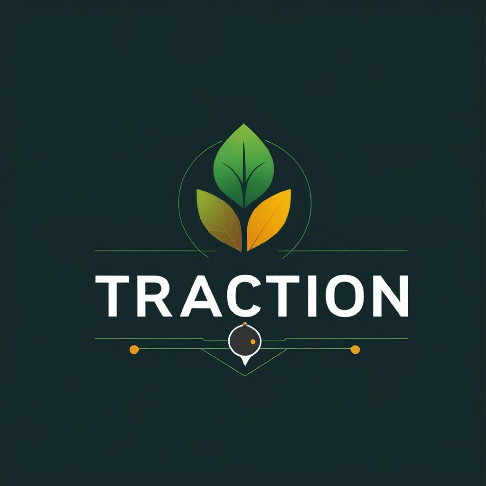
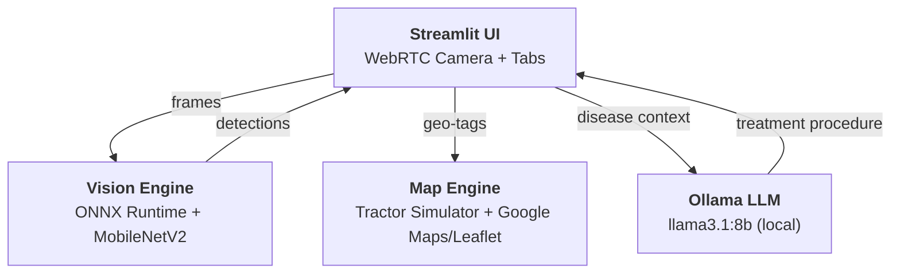

<div align="center">



<br/>

<p align="center">
  
</p>


<br/><br/>

[](https://qualcomm.com)

<br/>

> **`Live dashcam feed → ONNX inference → Geo-tagged disease detection → AI treatment procedures`**

<br/>


<br/><br/>


</div>

---

## The Problem

Crop diseases cost billions in annual losses globally. Scouting is manual, slow, and error-prone — farmers drive through fields visually inspecting plants, often missing early-stage infections until it's too late. Existing solutions require cloud connectivity, which is unreliable in rural farmland.

## Our Solution

Traction turns any tractor dashcam into a real-time crop disease detection system running entirely on edge hardware. A MobileNetV2 model (ONNX) classifies corn leaf diseases at ~6 FPS, geo-tags detections to a simulated tractor position, plots them on an interactive farm map, and generates AI treatment procedures via a local LLM — all without an internet connection.

---

## Key Features

**Live Inference** — Browser camera opened via WebRTC, frames processed through an ONNX inference engine with temporal smoothing (15-frame majority vote). Detects Cercospora Leaf Spot, Common Rust, Northern Leaf Blight, and Healthy leaves with confidence-gated logging (85%+) and automatic high-confidence captures (92%+).

**Ghost Tractor Simulator** — Simulates a tractor driving a boustrophedon (lawnmower) pattern across a configurable field. Default: ~140 acres near Arena, WI at 5 MPH. Position advances in real-time and disease detections are geo-tagged with Haversine deduplication.

**Farm Map** — Google Maps (satellite/hybrid/roadmap/terrain) or Leaflet.js fallback. Shows field boundary, tractor position with directional arrow, path trail, disease markers, and heatmap layer. Interactive or locked-view mode.

**AI Treatment Procedures** — Sends disease context (label, confidence, location, farm name) to a local Ollama LLM (llama3.1:8b). Returns structured field treatment recommendations with no cloud dependency.

**Hardware Monitoring** — Real-time CPU/RAM/GPU/NPU utilization, inference FPS, avg and P95 latency, efficiency scoring. Auto-detects Qualcomm QNN, NVIDIA CUDA, Apple CoreML, or CPU providers.

**Data Persistence** — Detection events and live session data written to CSV. Automatic frame capture and session video recording (MP4). Browse everything in the Gallery tab.

**Accessibility** — 7 color schemes (Night Field, Daylight Paper, Green Cabin, Amber Signal, Skyline Blue, Dust Gray, Field Sunrise), Sunlight Boost mode for outdoor readability, High Contrast and Invert Colors modes.

---

## Architecture



| Layer | Technology |
|:------|:-----------|
| **UI** | Streamlit, streamlit-webrtc, streamlit-autorefresh |
| **Inference** | ONNX Runtime (QNN / CUDA / CoreML / CPU), MobileNetV2 |
| **Vision** | OpenCV, NumPy, PyAV |
| **Maps** | Google Maps JavaScript API, Leaflet.js + ESRI tiles |
| **LLM** | Ollama (llama3.1:8b) |
| **Training** | PyTorch, torchvision, PlantVillage dataset |
| **Telemetry** | psutil, nvidia-smi |

---

## App Tabs

| Tab | Description |
|:----|:------------|
| **Drive** | Live camera feed, detection status, AI treatment advisory, farm map, event log |
| **Data Visualization** | Disease analytics — heatmaps, charts, tables from live and historical data |
| **AI Procedure** | Ollama LLM configuration and structured treatment generation |
| **NPU/GPU/CPU Power** | Real-time hardware utilization, latency histograms, provider details |
| **Gallery** | Captured images, recorded session videos, event logs |
| **Settings** | Color schemes, accessibility, farm location, profile management |
| **Help + Demo** | Operator instructions and demo video |

---

## ML Pipeline

**Model:** MobileNetV2 (ImageNet pretrained, 4-class transfer learning)

| Component | Detail |
|:----------|:-------|
| Head | `Dropout(0.2)` → `Linear(1280, 4)` |
| Input | `(1, 3, 224, 224)` float32, ImageNet normalized |
| Export | ONNX opset 14 (Qualcomm QNN compatible) |
| Classes | Cercospora Leaf Spot, Common Rust, Northern Leaf Blight, Healthy |
| Dataset | PlantVillage corn subset (augmented) |
| Training | Adam, lr=1e-3, 5 epochs, batch 32 |
| Smoothing | 15-frame majority vote (eliminates motion blur flicker) |

**Inference provider priority:** Qualcomm QNN → NVIDIA CUDA → DirectML → Apple CoreML → CPU

---

## Quick Start

### Prerequisites

| Dependency | Install | Verify |
|:-----------|:--------|:-------|
| **Python 3.9+** | [python.org](https://python.org) | `python3 --version` |
| **Ollama** | [ollama.com](https://ollama.com) | `ollama --version` |

### Automated Setup

```bash
git clone https://github.com/schoudhary90210/traction.git
cd traction
./setup.sh
```

This creates a venv, installs dependencies, installs Ollama if needed, and pulls `llama3.1:8b`.

### Run

```bash
source .venv/bin/activate
streamlit run app.py
```

Open `http://localhost:8501` — you should see the Traction dashboard.

### Optional: Google Maps

Create `.streamlit/secrets.toml`:

```toml
GOOGLE_MAPS_API_KEY = "your-key"
```

Without a key, Leaflet.js with ESRI/OpenStreetMap tiles is used automatically.

### Train Your Own Model

```bash
python train_model.py       # Train MobileNetV2, exports .pth + .onnx
python convert_to_onnx.py   # Re-convert .pth → .onnx (fixes PyTorch 2.x bug)
python test_inference.py    # Validate inference on a test image
```

---

## Project Structure

```
traction/
├── app.py                  # Streamlit application (UI + coordination)
├── vision_engine.py        # ONNX inference engine + temporal smoothing
├── map_engine.py           # Tractor simulator + map HTML generation
├── train_model.py          # MobileNetV2 training script
├── convert_to_onnx.py      # PyTorch → ONNX conversion
├── test_inference.py       # Standalone inference validation
├── requirements.txt        # Python dependencies
├── setup.sh                # One-command setup
├── scripts/
│   └── setup_traction.sh   # Full setup script
├── models/
│   ├── *.onnx              # Exported ONNX model
│   └── *.pth               # PyTorch checkpoint
├── assets/
│   ├── traction-header-brand.png
│   └── traction-logo.svg
└── dataset/
    ├── archive/            # PlantVillage corn dataset
    ├── detections/         # Geo-tagged detection CSVs
    └── live_sessions/      # Session recordings + events
```

---

## Configuration

| Variable | Default | Description |
|:---------|:--------|:------------|
| `GOOGLE_MAPS_API_KEY` | — | Google Maps API key (falls back to Leaflet) |
| `OLLAMA_BASE_URL` | `http://127.0.0.1:11434` | Ollama server URL |
| `OLLAMA_MODEL` | `llama3.1:8b` | LLM model for treatment procedures |

Set via environment variables or `.streamlit/secrets.toml`.

---

## Troubleshooting

| Issue | Fix |
|:------|:----|
| Camera not working | Allow browser camera access, check WebRTC STUN connectivity |
| Ollama not responding | Run `ollama serve` in a separate terminal |
| Model not found | Run `ollama pull llama3.1:8b` |
| Slow inference | Check provider: QNN/CUDA preferred over CPU. See NPU/GPU/CPU Power tab |
| No map tiles | Without Google Maps key, Leaflet/ESRI tiles are used. Check internet connection |
| Port in use | `lsof -ti:8501 | xargs kill -9` then restart |

---

<div align="center">

*Traction is a prototype edge AI tool for agricultural research — not a certified crop advisory system.*

**Qualcomm Edge AI Hackathon 2026**

</div>
